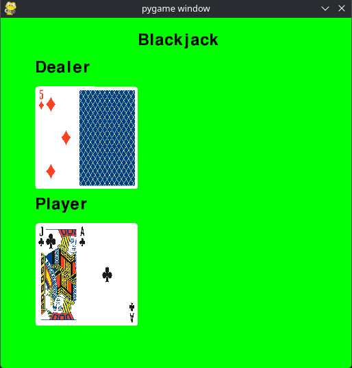
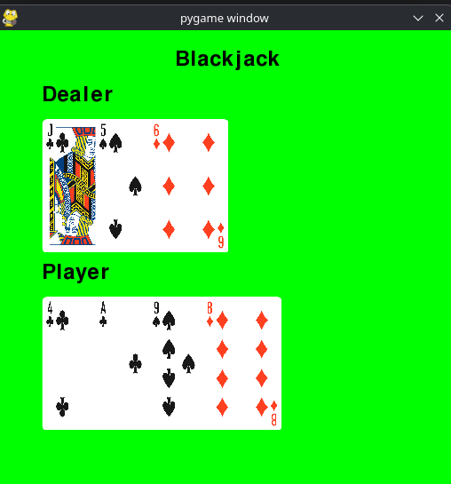

# Blackjack custom Gymnasium environment game

Project focuses on a Blackjack game implementation using the Python library _Gymnasium_. The game environment can be used for reinforcement learning projects.

Currently, there are two versions of the Blackjack environment:
- [**Blackjack4game-v0**](./blackjack_env/envs/blackjack_v0.py) - basic implementation with discrete action space
- [**Blackjack4game-v1**](./blackjack_env/envs/blackjack_v1.py) - implementation featuring betting at the beggining of a game - where an agent can decide what percentage of money to bet (continuous action space)

Blackjack rules
- [in Polish](https://pl.wikipedia.org/wiki/Blackjack)
- [in English](https://en.wikipedia.org/wiki/Blackjack)



**Note:** The current implementation does not support SPLIT moves. Besides that, most other standard rules apply. There are still areas for improvement - some of them are marked with #TODO comment in the code.

## Requirements

- Python\
  [configuration file](./pyproject.toml) (pyproject.toml)

Install project and its dependencies with:
--
``` bash
pip install -e .
```
- (in the project root directory)

## Usage

1. **Clone the repository:**

   ```bash
   git clone https://github.com/jakseluz/blackjack_gym.git
   cd blackjack_gym
   ```

2. Use the environment in a selected version:
    ```python
    import gymnasium as gym
    import blackjack_env

    # version 0 (see README description above)
    env = gym.make("Blackjack4game-v0", render_mode="terminal") # render_mode="human" if you want to use GUI (or None if neither)

    # version 1
    # env = gym.make("Blackjack4game-v1", render_mode="terminal")

    # use it like other gymnasium environments;
    ```
3. To see how to use the gymnasium environment, see: [gymnasium documentation](https://gymnasium.farama.org/introduction/basic_usage/).

3. Check **./notebooks/ directory** for the tutorial/ information:
    - **./notebooks/[main.ipynb](./notebooks/main.ipynb) file** - Blackjack4game-v0 tutorial
    **./notebooks/[bet_example.ipynb](./notebooks/bet_example.ipynb) file** - additional info about Blackjack4game-v1 version
4. More detailed analysis available (in Polish) in
    - **./notebooks/[report.ipynb](./notebooks/report.ipynb)**
    - **./notebooks/[report_continuous_env.ipynb](./notebooks/report_continuous_env.ipynb)**

## Authors
- **Jakub Łabuz** ([jakseluz](https://github.com/jakseluz)) - Blackjack
- **Maciej Maj** ([mmaj1](https://github.com/mmaj1)) - tests and report

## Used resources:
- [Playing Card Deck](https://opengameart.org/content/bridge-sized-playing-card-deck-png-cc0)
- [Gymnasium Environment Template](https://gymnasium.farama.org/tutorials/gymnasium_basics/environment_creation/)

---

_For questions or contributions, please open an issue or submit a pull request!_